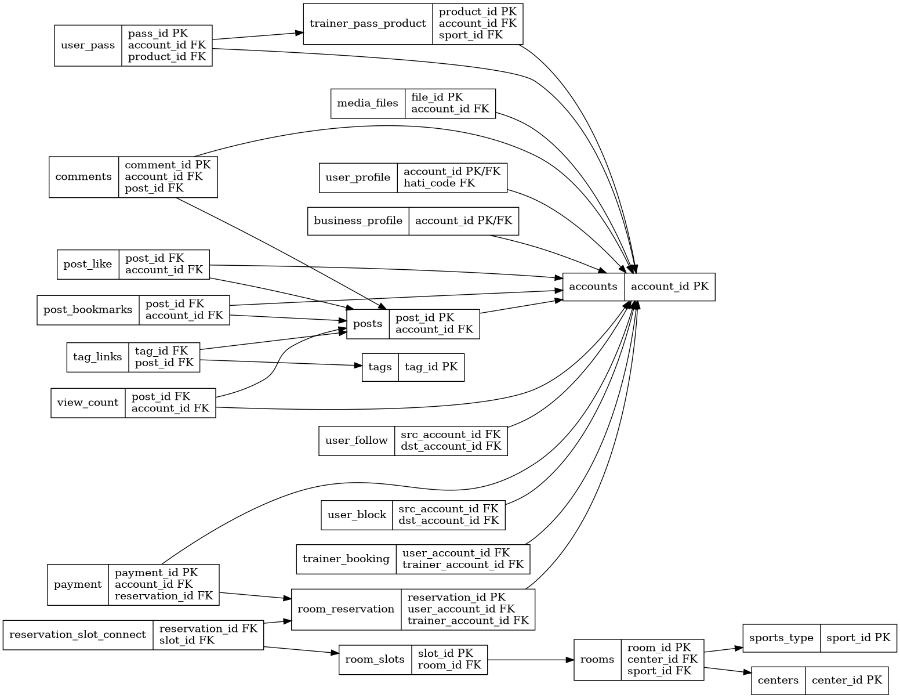
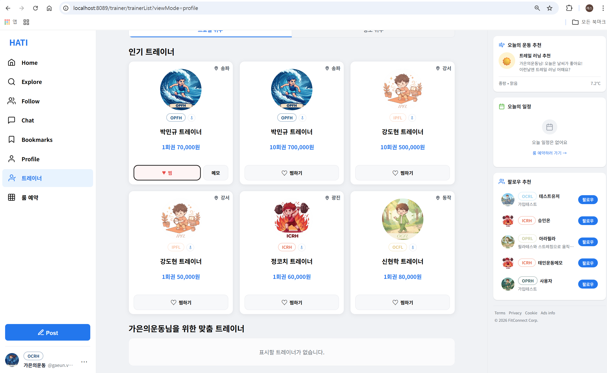
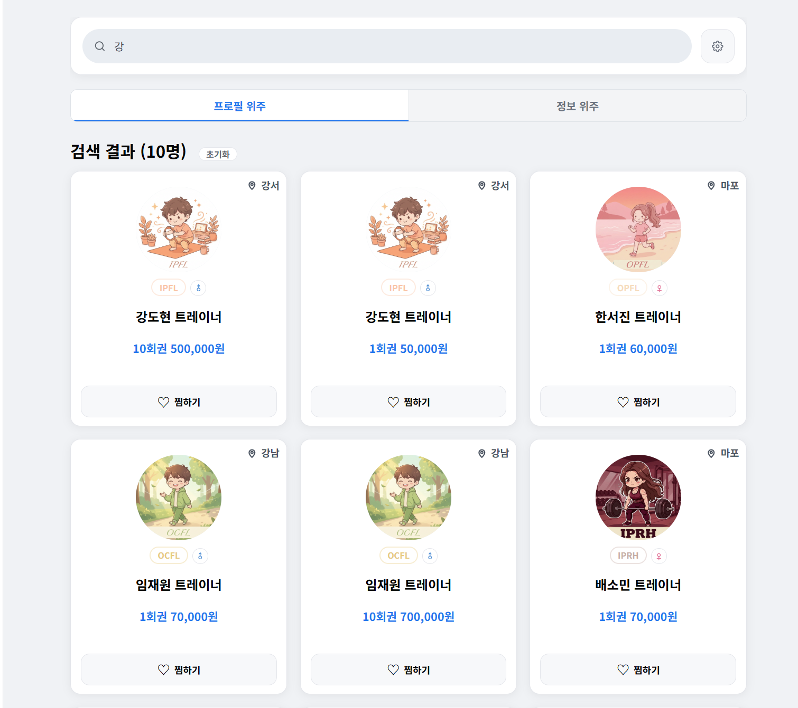
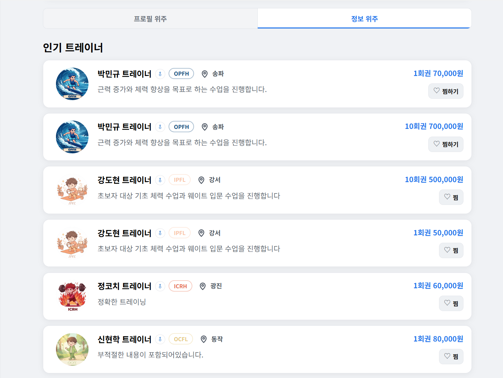

# HATI

> 운동 성향(HATI) 분석을 기반으로 사용자 맞춤형 커뮤니티를 제공하고,  
> 트레이너 탐색부터 채팅, 예약, 결제까지 연결한 운동 특화 SNS & 트레이너 매칭 플랫폼

- **팀 구성**: 5인 프로젝트 (최종 4인 마무리)
- **개발 기간**: 2026.02.02 ~ 2026.03.13

---

## 1. 프로젝트 개요

HATI는 운동 성향 분석 결과를 기반으로 사용자 맞춤형 커뮤니티 경험을 제공하고,  
트레이너 탐색, 이용권 관리, 예약 및 결제 기능까지 하나의 흐름으로 연결한 웹 플랫폼입니다.

사용자는 자신의 운동 성향에 맞는 게시글과 커뮤니티를 이용할 수 있으며,  
트레이너 탐색 및 예약 기능을 통해 운동 서비스까지 연계할 수 있습니다.

---

## 2. 기술 스택

### Backend
- Java
- Spring MVC
- MyBatis
- Maven
- Tomcat

### Frontend
- JSP
- JSTL
- JavaScript
- HTML / CSS

### Database
- Oracle Database

### Tools / Collaboration
- Git
- GitHub
- Notion
- Figma

### External / API
- Kakao Map API, PortOne, WebSocket

---

## 3. 주요 기능

### 3-1. 회원 / 인증
- 사용자 유형에 따른 회원가입 분기 및 로그인 기능 제공
- 세션 기반 인증 및 권한 처리
- 운동 성향(HATI) 테스트와 회원가입 흐름 연계

### 3-2. 커뮤니티
- 게시글 / 댓글 작성, 수정, 삭제 기능
- 북마크 및 게시글 상세 조회 기능
- 게시글 상호작용 기반 커뮤니티 기능 제공

### 3-3. 트레이너 
- 트레이너 탐색 및 검색 기능 제공
- 조건 기반 필터링 및 정렬 기능 지원

### 3-4. 결제 / 예약
- 예약 기반 결제 처리
- 결제 상태 및 예약 상태 분리 관리

### 3-5. 관리자
- 사용자 신고 관리 및 제재 처리
- 계정 정지 / 해제 기능
- 부적절 게시글 및 트레이너 승인 관리

### 3-6. 기타 (팀 구현)
- WebSocket 기반 실시간 채팅
  - 1:1 채팅 / 그룹 채팅
  - 이미지 및 파일 전송
  - 그룹 채팅방 사용자 관리
- KakaoPay 기반 결제 프로세스

---

## 4. 담당 역할

### 트레이너 탐색 기능 설계 및 개발
- 트레이너 목록 조회 및 프로필 진입 흐름 구현
- 사용자 맞춤 트레이너 / 인기 트레이너 초기 노출 로직 구현
- 검색 조건(필터링) 기반 트레이너 조회 기능 구현
- 정렬 및 보기 방식(리스트 / 카드) 전환 기능 구현

### 사용자 상호작용 기능
- 트레이너 찜(좋아요) 기능 구현 (AJAX 기반 비동기 처리)
- 트레이너 메모 기능 구현 (사용자 개인화 데이터 관리)

### UI/UX 개선
- 무한 스크롤 기반 데이터 로딩 처리
- 스크롤 위치에 따른 추가 데이터 렌더링 구현
- 보기 방식 전환 시 상태 유지 로직 개선

### 문제 해결 및 안정성 개선
- 검색 상태에서 보기 방식 전환 시 데이터 초기화 문제 해결
- 필터/정렬/보기 상태를 통합 관리하도록 구조 개선

---

## 5. 실행 방법


1. 프로젝트 클론
 ```bash
  git clone https://github.com/juyoung-2/HATI-_-Team-Project.git
  ```

2. Oracle DB 설정 및 SQL 실행

3. DB 연결 정보 수정 (root-context.xml)

4. Tomcat 서버 실행

5. 브라우저 접속
 ```bash
  http://localhost:8098
 ```


---

## 6. 시스템 아키텍처

- Spring MVC 패턴 기반 계층 구조
  - Controller: 요청 처리 및 API 응답
  - Service: 비즈니스 로직 처리
  - Mapper(MyBatis): DB 접근

- 도메인 기반 패키지 분리
  (user, post, trainer, reservation, payment 등)

- 비동기 처리
  - AJAX 기반 일부 기능 비동기 처리

- 파일 관리
  - 이미지 파일: AWS S3 저장
  - DB: 파일 메타데이터 관리

---

## 7. DB 설계

### ERD

프로젝트의 주요 도메인(Account, Post, Trainer, Reservation, Payment) 간 관계를 중심으로 설계한 ERD입니다.  



---

## 8. 화면 예시

- 트레이너 목록 (기본 화면)
  - 맞춤 트레이너 / 인기 트레이너 노출
  

- 트레이너 검색 결과
  - 조건 필터링 및 정렬 기능
  

- 보기 방식 전환
  - 리스트 / 카드 UI 전환
  


---

## 9. 트러블슈팅

### 1. 검색 상태에서 보기 방식 전환 시 데이터 초기화 문제

- 문제  
  검색 결과 화면에서 보기 방식(리스트 / 카드)을 전환할 경우  
  기존 검색 조건이 유지되지 않고 초기 화면 데이터로 돌아가는 문제가 발생

- 원인  
  - 검색 조건, 정렬 상태, 보기 방식 상태를 각각 별도로 관리
  - 상태 간 의존성이 고려되지 않아 UI 전환 시 데이터 요청 파라미터가 초기화됨

- 해결  
  - 검색 조건, 정렬, 보기 방식 상태를 하나의 객체로 통합 관리
  - AJAX 요청 시 해당 상태 객체를 함께 전달하도록 구조 개선
  - 화면 전환 시에도 동일 상태를 유지하도록 로직 수정

- 결과  
  - 검색 이후에도 보기 방식 전환 시 동일한 결과 유지
  - 사용자 경험(UI 흐름) 안정성 개선

### 2. 무한 스크롤 데이터 중복 로딩 문제

- 문제  
  스크롤 시 동일한 데이터가 반복적으로 로딩되는 현상 발생

- 원인  
  - 페이지 기준 offset 처리 미흡
  - 마지막 데이터 기준이 아닌 단순 페이지 증가 방식 사용

- 해결  
  - 마지막 데이터 기준(cursor 기반) 조회 방식으로 변경
  - 프론트에서 중복 요청 방지 로직 추가

- 결과  
  - 데이터 중복 제거
  - 스크롤 UX 개선

---

## 10. 성과 및 배운 점

- 트레이너 탐색 기능을 구현하면서 검색, 필터, 정렬, 보기 방식 전환이 각각 독립된 기능처럼 보이지만 실제로는 하나의 흐름으로 연결되어 있다는 점을 경험했습니다.
- 특히 검색 결과 상태에서 보기 방식을 전환할 때 데이터가 초기화되는 문제를 해결하며, 화면에 보이는 UI뿐 아니라 상태를 어떻게 설계하고 유지할지까지 함께        고려해야  한다는 점을 배웠습니다.
- 무한 스크롤을 구현하는 과정에서는 단순히 데이터를 더 불러오는 것에서 끝나는 것이 아니라, 중복 요청 방지와 기존 데이터 유지, 추가 렌더링 시점까지 함께 관리해야 안정적인 사용자 경험을 만들 수 있다는 점을 체감했습니다.
- 이번 작업을 통해 기능 구현 자체보다도, 사용자가 흐름이 끊기지 않는 화면을 경험할 수 있도록 만드는 것이 더 중요하다는 점을 배웠습니다.


---

## 11. 회고 / 개선 방향

- 처음에는 검색, 정렬, 필터, 보기 전환 기능을 각각 개별적으로 구현하면 된다고 생각했습니다. 하지만 실제로는 한 기능의 변경이 다른 기능의 동작에도 영향을 주었고, 그 과정에서 기능을 나누어 접근하는 방식의 한계를 느꼈습니다.
- 특히 검색 상태에서 보기 방식을 전환했을 때 결과가 유지되지 않는 문제를 겪으면서, 화면 단위가 아니라 사용자 흐름 단위로 구조를 설계해야 한다는 점을 크게 느꼈습니다.
- 또한 구현 과정에서 “기능이 동작하는 것”과 “사용하기 자연스러운 것”은 다르다는 점도 배웠습니다. 같은 기능이라도 상태가 어색하게 초기화되거나 흐름이 끊기면 사용자 입장에서는 완성도가 낮게 느껴질 수 있다는 점을 경험했습니다.
- 아쉬웠던 점은 검색, 필터, 정렬, 보기 전환처럼 서로 연결된 기능들을 초기에 하나의 흐름으로 보지 못해, 구현 이후 상태 관리 방식을 다시 정리하면서 수정 범위가 커졌다는 점입니다.
- 다음에는 화면 단위가 아니라 사용자 흐름 단위로 상태를 먼저 정리하고, 공통으로 관리해야 할 파라미터와 UI 전환 규칙을 초기에 설계한 뒤 개발을 진행하고 싶습니다. 이번 경험을 통해 구현 속도보다 초기 구조 설계가 이후 유지보수와 사용자 경험에 더 큰 영향을 준다는 점을 배웠습니다.

---